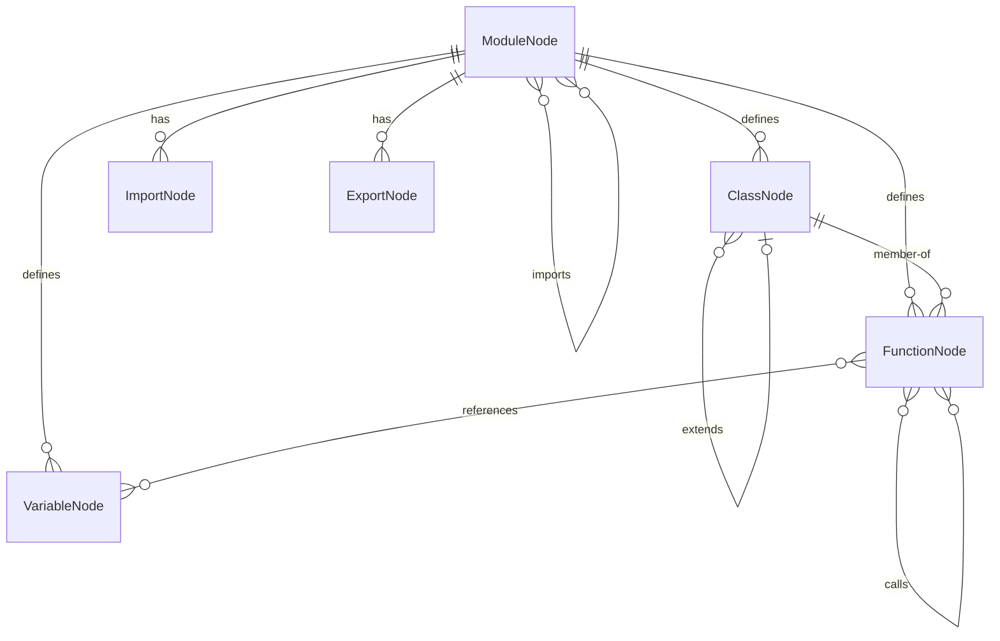

# Code Graph Schema

The code graph represents a codebase as a directed graph of **nodes** (symbols) and **edges** (relationships).

## Node Types

| Type | Description | Key Properties |
| ------ | ------------- | ---------------- |
| `Module` | A source file | `file`, `language` |
| `Class` | Class definition | `file`, `line`, `name`, `exported` |
| `Function` | Function/method definition | `file`, `line`, `name`, `exported`, `async`, `params` |
| `Variable` | Variable/constant declaration | `file`, `line`, `name`, `exported`, `kind` (`const`/`let`/`var`) |
| `Import` | An import statement | `file`, `line`, `source`, `specifiers` |
| `Export` | An export statement | `file`, `line`, `specifiers` |

### Node ID Convention

Each node has a unique ID: `<relative-file-path>::<symbol-name>`

Examples:

- `src/llm/analyzer.js::analyzeArticle`
- `src/storage/db.js::Database`
- `src/config.js::config`

For module-level nodes, the ID is just the file path: `src/config.js`.

## Edge Types

| Type | From → To | Meaning |
| ------ | ----------- | --------- |
| `calls` | Function → Function | Function A calls function B |
| `imports` | Module → Module | Module A imports from module B |
| `extends` | Class → Class | Class A extends class B |
| `implements` | Class → Interface | Class A implements interface B |
| `references` | Function → Variable | Function A reads/writes variable B |
| `exports` | Module → Symbol | Module A exports symbol B |
| `member-of` | Function → Class | Function A is a method of class B |

## Schema Diagram



## JSON Representation

```json
{
  "nodes": [
    {
      "id": "src/config.js",
      "type": "Module",
      "file": "src/config.js",
      "language": "javascript"
    },
    {
      "id": "src/config.js::loadConfig",
      "type": "Function",
      "file": "src/config.js",
      "line": 10,
      "name": "loadConfig",
      "exported": true
    }
  ],
  "edges": [
    {
      "from": "src/digest-generator.js::generateDigest",
      "to": "src/config.js::loadConfig",
      "type": "calls"
    },
    {
      "from": "src/digest-generator.js",
      "to": "src/config.js",
      "type": "imports"
    }
  ]
}
```

## Usage Notes

- **Granularity**: Start with module-level nodes for dependency analysis. Add function-level only when needed for call-graph queries.
- **Partial graphs**: You don't need to build the full graph. Parse only the files relevant to your query.
- **Incremental updates**: When a file changes, re-parse only that file and update its nodes/edges.
